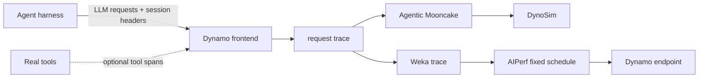

Agent trace replay reproduces the serving workload created by an agent, not the
agent's decisions. It preserves request timing, token lengths, prompt-block
identity, and session relationships without storing prompts, responses, or tool
arguments.

The same capture can drive an offline DynoSim simulation or a live AIPerf run:



## Capture a Live Run

Enable request tracing on the frontend that receives the agent traffic:

```bash
export DYN_REQUEST_TRACE=1
export DYN_REQUEST_TRACE_OUTPUT_PATH=/tmp/agent-run/request-trace

# Optional: bind the ingress used by a harness that publishes explicit tool spans.
export DYN_REQUEST_TRACE_TOOL_EVENTS_ZMQ_ENDPOINT=tcp://127.0.0.1:20390
```

Run the normal agent benchmark against that endpoint. Each reasoning/tool chain
should send `X-Dynamo-Session-ID`; child agents should also send
`X-Dynamo-Parent-Session-ID`. Tracing is passive and does not change routing or
enable session affinity.

The sink writes rotating `request-trace.NNNNNN.jsonl.gz` files. Stop the
frontend, or otherwise allow the sink to flush, before converting them. See
[Agent Tracing](agent-tracing.md) for the record schema, Perfetto conversion,
and tool-event wire format.

## How the Request Graph Is Built

The converter turns trace rows into a dependency graph:

- `session_id` orders requests into one linear agent chain.
- `parent_session_id` adds a child branch to its direct parent session.
- `request_received_ms` determines the recorded arrival schedule.
- `replay.input_length`, `output_tokens`, and `input_sequence_hashes` reproduce
  the request shape and complete-block prompt-prefix relationships.
- The trace retains terminal tool rows for per-tool measurements. AIPerf does
  not replay those rows or execute tools; request timestamps still preserve the
  combined tool and harness delay before the next LLM call. Agentic Mooncake
  additionally uses terminal tool rows to retain tool-wait decomposition.

AIPerf writes one Weka file per root session. Requests inside a session remain
dependent, while independent roots and child branches can overlap. Root
requests target their recorded timestamps. A later turn starts no earlier than
both its recorded target and the completion of its predecessor, so a slower
endpoint accumulates positive schedule drift instead of overlapping turns from
the same session.

Dynamo sequence hashes become Weka `hash_ids` with `hash_id_scope: "global"`.
The scope means the same `(block_size, hash_id)` in different root files
reconstructs to the same synthetic token block. This preserves cross-session
complete-block prefix reuse without exposing the original tokens.

## Convert for AIPerf

This path currently requires
[AIPerf PR #3](https://github.com/ajcasagrande/aiperf/pull/3). The converter
reads uncompressed JSONL:

```bash
gzip -cd /tmp/agent-run/request-trace.*.jsonl.gz > /tmp/agent-run/request-trace.jsonl

aiperf synthesize dynamo-trace /tmp/agent-run/request-trace.jsonl \
  --output /tmp/agent-run/weka
```

The output should contain the same number of requests and root sessions as the
capture. The current Weka graph supports one direct child-session level; the
converter rejects deeper trees instead of flattening them silently.

## Replay Against a Live Endpoint

Each converted Weka file declares its capture block size, which AIPerf honors
automatically:

```bash
AIPERF_DATASET_WEKA_SPLIT_FLATTENED_AGENTS=false \
AIPERF_DYNAMO_SESSION_TRANSPORT=headers \
aiperf profile \
  --url http://localhost:8000 \
  --model my-model \
  --tokenizer /path/to/my-model \
  --endpoint-type chat \
  --input-file /tmp/agent-run/weka \
  --custom-dataset-type weka_trace \
  --fixed-schedule \
  --fixed-schedule-auto-offset \
  --use-dynamo-conv-aware-routing \
  --use-server-token-count \
  --extra-inputs ignore_eos:true \
  --output-artifact-dir /tmp/agent-run/aiperf
```

Do not add a concurrency or request-rate cap for a faithful replay. The graph
and recorded timestamps supply the concurrency. Header transport is required
by current Dynamo releases. `ignore_eos:true` makes the backend generate the
recorded output length instead of stopping early on newly sampled content. The
split override keeps AIPerf from applying its native Weka chain detector to the
graph that the Dynamo converter already constructed.

## Check Replay Fidelity

Treat these as the minimum alignment checks:

- Captured, converted, AIPerf, and replayed request counts match.
- Captured and replayed session counts and per-session turn counts match.
- AIPerf reports zero request errors.
- Every replayed output length matches the capture when `ignore_eos:true` is
  used.
- Relative arrival-time drift and request-duration drift are reported rather
  than assumed to be zero.

Synthetic prompts preserve hash-block topology, not original text. Wire input
length can differ slightly because the target tokenizer and chat serialization
reconstruct the request. Service time can also differ even against the same
model. For cache comparisons, keep model, tokenizer, block size, worker
topology, and initial cache state identical; compare `cached_tokens` or
`kv_hit_rate` when the capture provides them.

See the [AIPerf Weka replay guide](https://github.com/ishandhanani/aiperf/blob/idhanani/agentx-dynamo-trajectories/docs/tutorials/weka-trace.md#replay-a-dynamo-request-trace)
for timing controls and graph details. This
[ToolOrchestra trace](https://gist.github.com/ishandhanani/31ffa697ca9d068624f280f10c19d45d)
is a complete multi-session input example.

## Replay Offline with DynoSim

For scheduling experiments that do not need model execution, convert the same
capture to Agentic Mooncake and run it through mock workers:

```bash
cargo run -p dynamo-bench --bin request_trace_to_mooncake -- \
  --agentic \
  --input-path /tmp/agent-run/request-trace.*.jsonl.gz \
  --output-file /tmp/agent-run/agentic-mooncake.jsonl

python -m dynamo.replay /tmp/agent-run/agentic-mooncake.jsonl \
  --trace-format agentic_mooncake \
  --trace-block-size 16 \
  --replay-mode offline \
  --router-mode kv_router \
  --num-workers 4 \
  --extra-engine-args '{"block_size":16}' \
  --report-json /tmp/agent-run/dynosim-report.json
```

`kv_router` needs at least two mock workers. See
[DynoSim Runs](../dynosim/runs.md) for engine configuration and replay reports.
